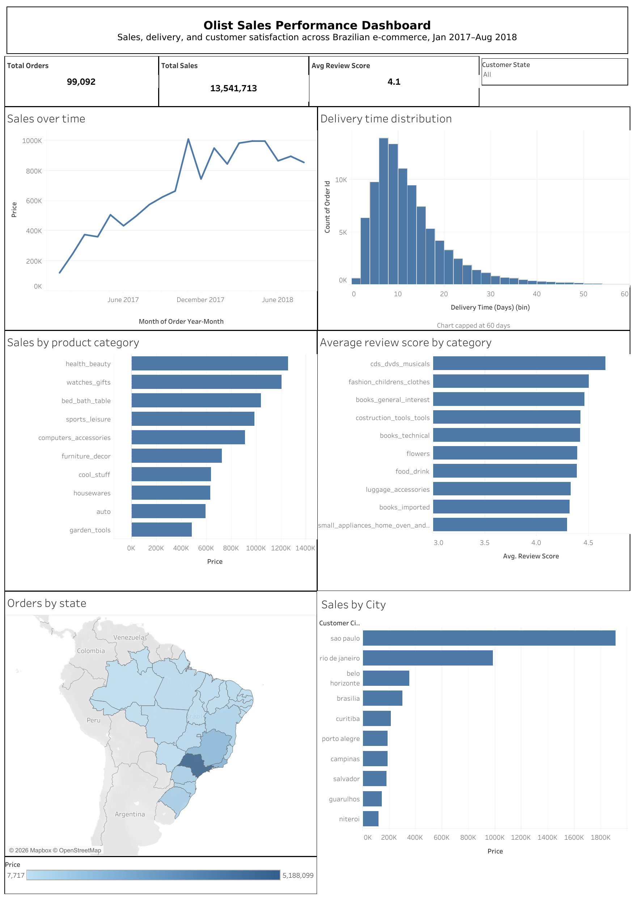
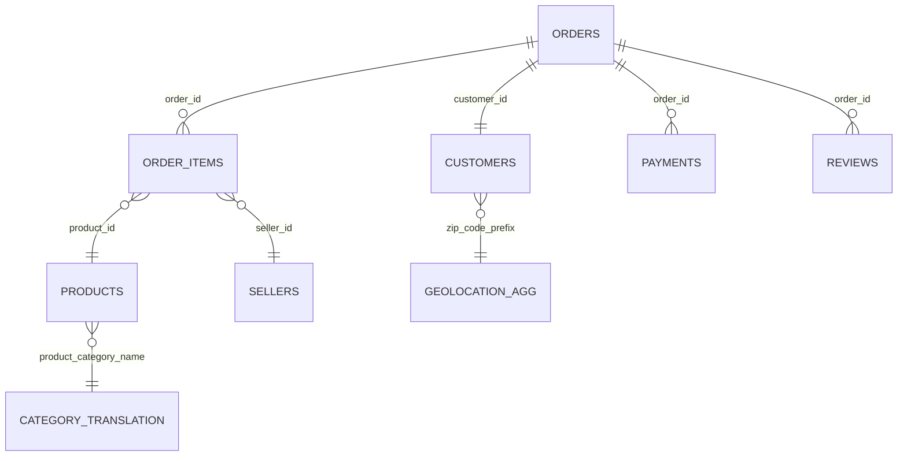

# Brazilian E-Commerce Sales Dashboard (Olist)

An interactive Tableau dashboard analyzing ~100,000 orders from Olist, a Brazilian e-commerce marketplace, covering sales trends, product categories, delivery performance, customer reviews, and geographic distribution.

**🔗 Live dashboard:** https://public.tableau.com/views/OlistSalesPerformancceDashboard/OlistSalesPerformanceDashboard?:language=en-GB&:display_count=n&:origin=viz_share_link
**📸 Preview:**



---

## Business question

Where is Olist's revenue coming from, and where are the biggest opportunities to improve — by product category, region, and delivery performance?

## Dataset

Source: [Brazilian E-Commerce Public Dataset by Olist](https://www.kaggle.com/datasets/olistbr/brazilian-ecommerce) (Kaggle)

9 relational CSV files covering orders, customers, order items, payments, reviews, products, sellers, seller/customer geolocation, and product category name translation (Portuguese → English), spanning Sept 2016 – Oct 2018.

## Data model

Tables were connected in Tableau using **relationships** (not traditional joins), which avoids row duplication (fan-out) across one-to-many tables — each table stays at its native grain until you pull specific fields into a view.



## Data cleaning

Raw files needed a few fixes before they were dashboard-ready:

| Issue | Fix |
|---|---|
| `product_category_name_translation.csv` had a hidden BOM character in its header (`\ufeffproduct_category_name`), silently breaking the join to the Products table even though the names looked identical on screen | Re-saved as plain `CSV (Comma delimited)` in Excel (not "CSV UTF-8," which actually adds the BOM back) — see `data/product_category_name_translation_fixed.csv` |
| `olist_geolocation_dataset.csv` had ~1,000,163 rows but only ~19,015 unique zip codes (up to 50+ duplicate lat/long rows per zip) — connecting it directly would have multiplied order rows | Aggregated to one row per zip code using an Excel PivotTable (lat/long averaged per zip), with city/state added back via `VLOOKUP` since those text fields can't be averaged — see `data/olist_geolocation_aggregated.csv` |
| Blank `product_category_name` on a small number of products | Calculated field: `IFNULL([Product Category Name English], "Unknown")` |
| Null `order_delivered_customer_date` for canceled/undelivered orders | Kept (expected, not an error) — flagged with a calculated `Is Delivered` field rather than dropped |
| Order count differs depending on which table's `Order ID` you count: 99,441 total orders placed vs. 98,666 orders that contain at least one item (the rest were canceled before checkout) | Documented both numbers; dashboard KPI uses total orders placed, within the Jan 2017–Aug 2018 window (99,092) |
| 1 order with no delivery date at all (never delivered) | Filtered out of the delivery-time histogram specifically; included everywhere else |
| Product category charts were hard to scan with 70+ categories, several with no clear ranking | Filtered both category charts to Top 10 by revenue / average rating; a small number of products with no listed category are grouped as "Unknown" (via the `Category (Clean)` field) rather than shown as blank/NULL |
| Sales trend line looked distorted (only 2-3 points, sharp misleading jump) because late 2016 was a sparse test-launch period with very few orders; the last month (Sept 2018) was also a partial/incomplete month of data collection, showing a misleading sharp drop | Filtered the trend chart to **Jan 2017 – Aug 2018** using a continuous, month-level date field (`DATETRUNC('month', ...)`) instead of Year, so the line reflects real, complete month-by-month activity |
| Checked `customer_city` for the same accent/spelling inconsistencies found in `geolocation_city` (e.g. "São Paulo" vs "Sao Paulo") before using it in a chart | Confirmed clean — no spelling variants found, so it was used as-is with no fix needed |

## Calculated fields

- **Delivery Time (Days)** — `DATEDIFF('day', [order_purchase_timestamp], [order_delivered_customer_date])`
- **Delivery Delay (Days)** — `DATEDIFF('day', [order_estimated_delivery_date], [order_delivered_customer_date])`
- **Is Delivered** — `IIF(ISNULL([order_delivered_customer_date]), "Not Delivered", "Delivered")`
- **Review Sentiment** — buckets review score into Positive (4–5) / Neutral (3) / Negative (1–2)
- **Order Year-Month** — `DATETRUNC('month', [order_purchase_timestamp])`
- **Category (Clean)** — fills blank product categories with "Unknown"

## Dashboard contents

- **KPI tiles:** Total Sales (13,541,713), Total Orders (99,092), Average Review Score (4.1) — all scoped to Jan 2017–Aug 2018
- **Sales trend:** monthly revenue over time (line chart), filtered to Jan 2017–Aug 2018 to exclude the sparse late-2016 test-launch period and the incomplete final month
- **Sales by category:** top product categories by revenue (bar chart)
- **Review score by category:** average rating per category (bar chart)
- **Orders by state:** revenue concentration across Brazilian states (filled map)
- **Delivery time distribution:** histogram of delivery times in 2-day buckets, capped at 60 days to keep outliers from skewing the view
- **Sales by city:** top 10 customer cities by revenue (bar chart); clicking a bar filters the rest of the dashboard to that city (via a dashboard filter action, rather than a separate dropdown — a city-level dropdown would have ~2,878 entries)
- **Filters:** a date filter (Jan 2017–Aug 2018) applied across all views, plus an interactive Customer State filter so viewers can drill into a specific region

## Repo structure

```
├── README.md
├── screenshot.png
├── dashboard.twbx                                    (Tableau packaged workbook)
└── data/
    ├── product_category_name_translation_fixed.csv   (BOM removed)
    └── olist_geolocation_aggregated.csv               (deduplicated, averaged by zip)
```

Raw source CSVs are not included in this repo due to file size — download them directly from [Kaggle](https://www.kaggle.com/datasets/olistbr/brazilian-ecommerce).

## Tools

Tableau Desktop / Tableau Public, Excel (PivotTable + VLOOKUP for geolocation aggregation; plain CSV save to fix the BOM character in the category translation file)
